# 🌸 isleap's dotfiles
A Hyprland rice with a dynamic theme switcher supporting multiple static themes and a live wallpaper-based color system powered by matugen.

---

## 📸 Preview
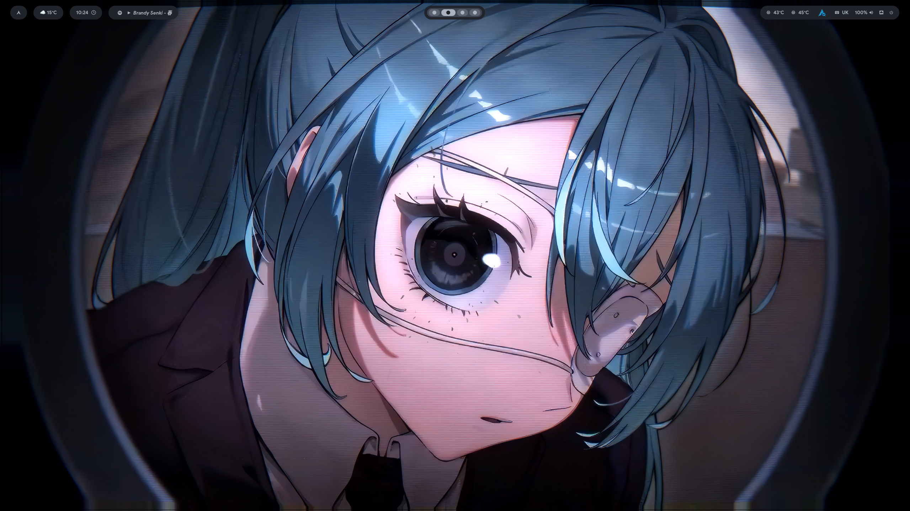
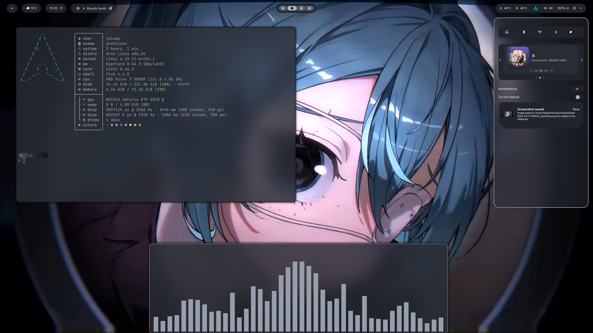
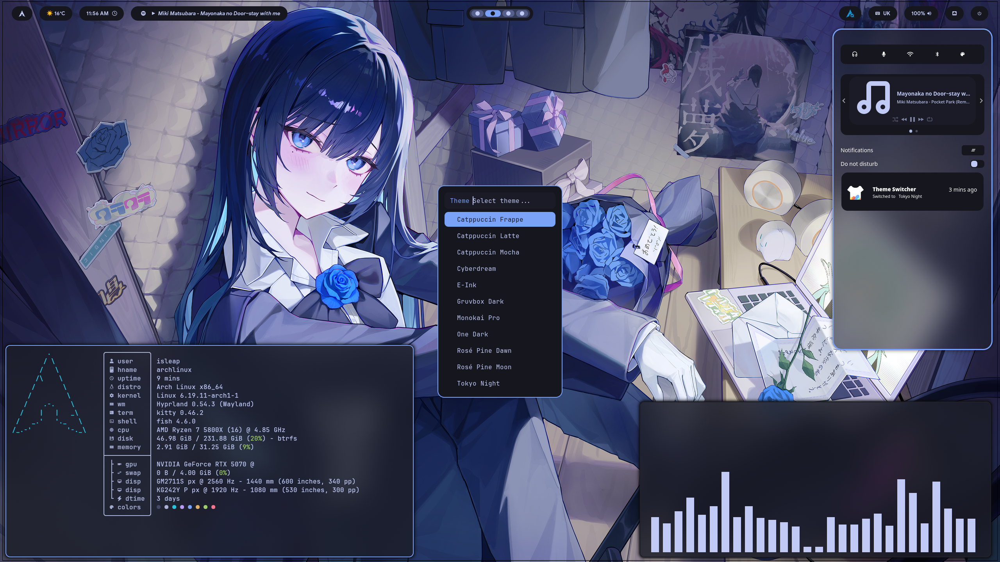
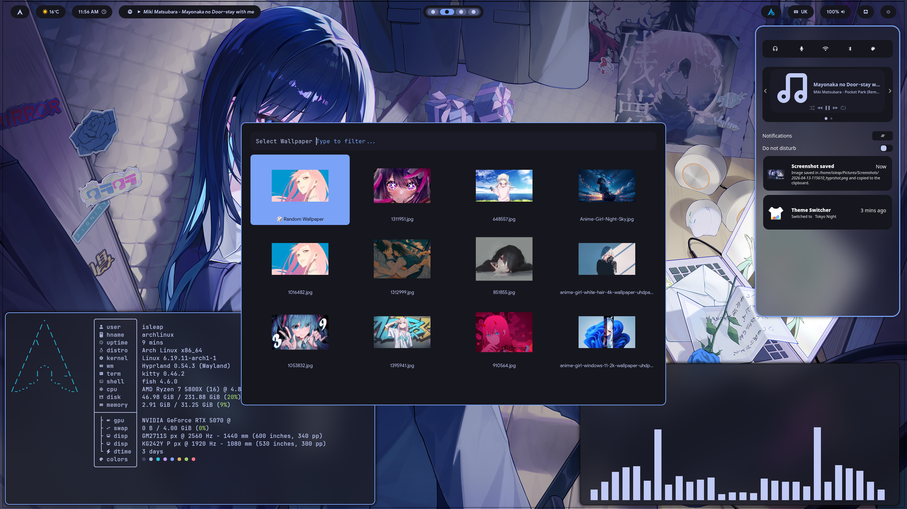
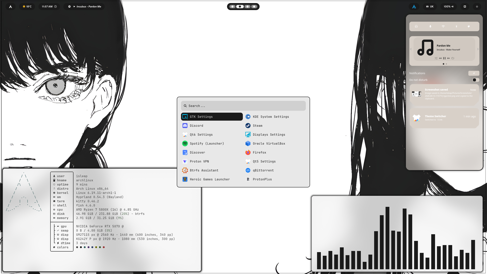
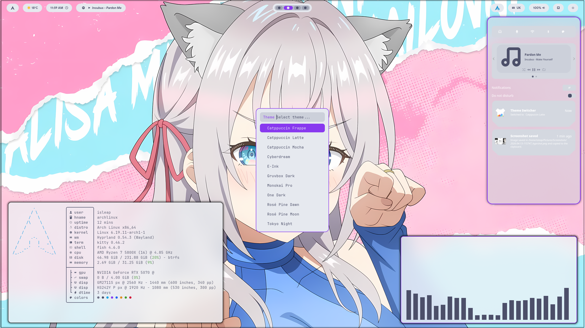
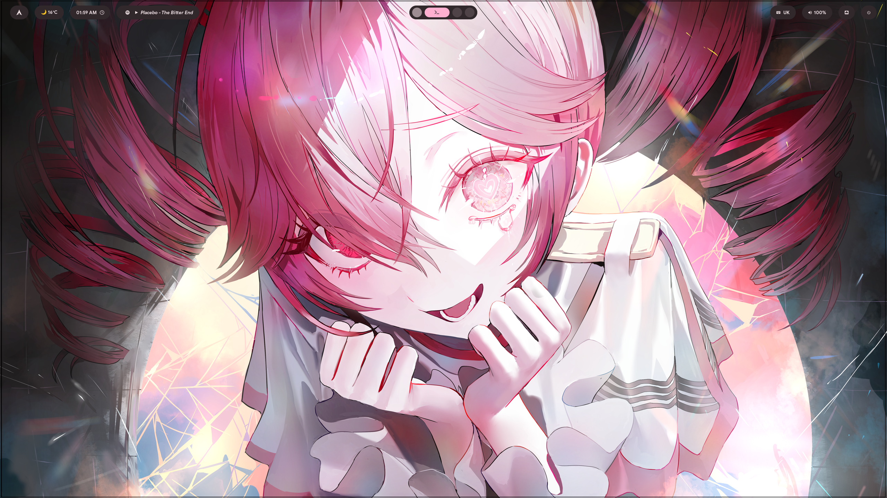

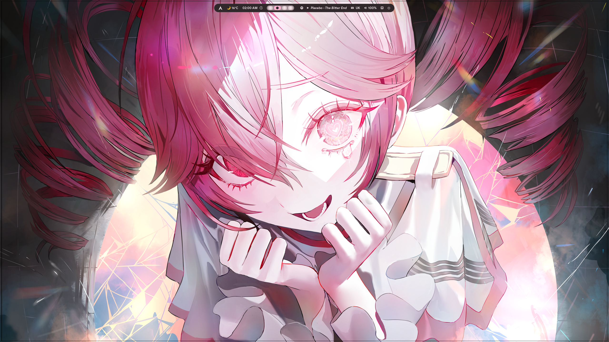
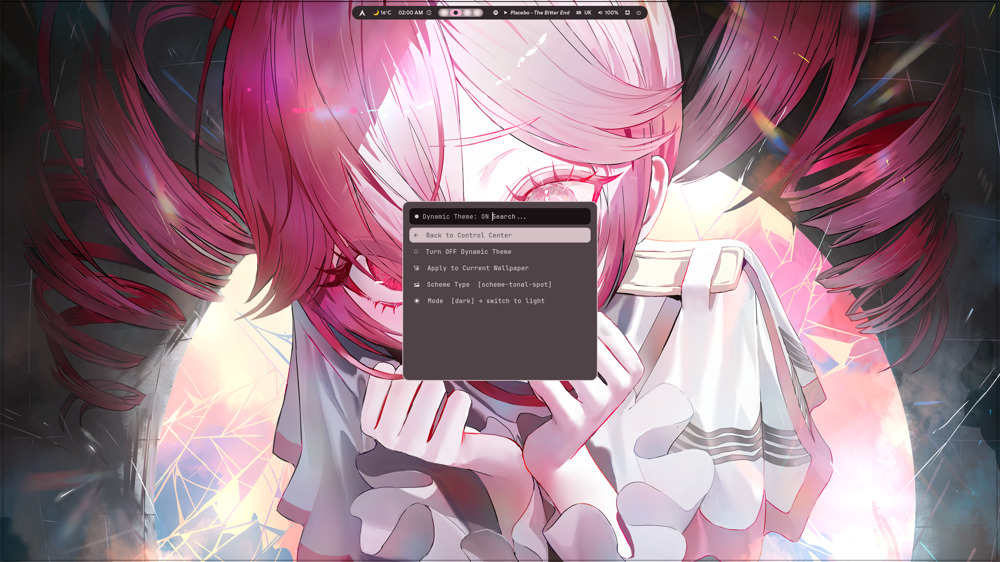
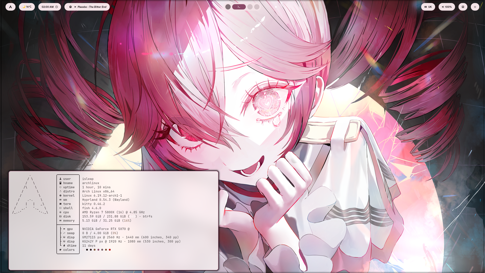
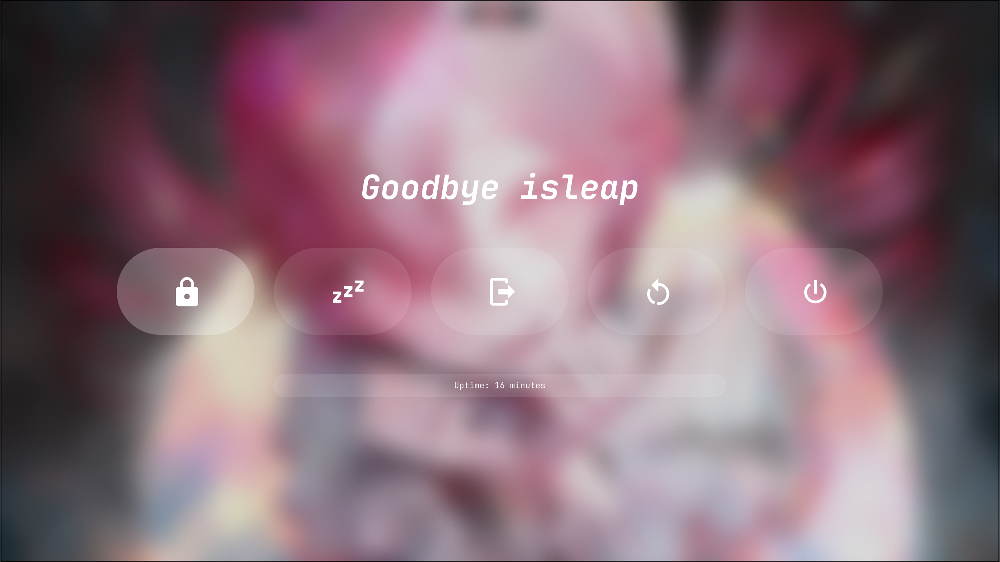

---

## 🖥️ System Info
| | |
|---|---|
| **OS** | Arch Linux |
| **WM** | Hyprland |
| **Bar** | Waybar |
| **Terminal** | Kitty |
| **Shell** | Fish |
| **Launcher** | Rofi |
| **Notifications** | Swaync |
| **File Manager** | Dolphin |
| **Wallpaper** | awww |
| **Color Extraction** | matugen |
| **Idle Daemon** | Hypridle |
| **Lock Screen** | Hyprlock (BlazinLock) |
| **Cursor** | Bibata-Modern-Ice |
| **GPU** | NVIDIA (nvidia-open-dkms) |

---

## 📦 Packages

### 🪟 Hyprland & WM
```
hyprland hypridle hyprlock polkit-gnome hyprshot
```

### 📊 Bar & Notifications
```
waybar swaync
```

### 🖼️ Wallpaper & Colors
```
awww matugen-bin (AUR)
```

### 🚀 App Launcher
```
rofi rofimoji
```

### 💻 Terminal
```
kitty
```

### 🔤 Fonts
```
ttf-rubik-vf
ttf-jetbrains-mono-nerd
google-sans-display (AUR)
ttf-firacode-nerd
ttf-nerd-fonts-symbols
otf-font-awesome
noto-fonts-cjk
```

### 🔊 Audio
```
pipewire pipewire-alsa pipewire-jack pipewire-pulse
wireplumber pavucontrol libpulse
```

### 📡 Bluetooth & Network
```
bluez bluez-utils network-manager-applet networkmanager
```

### 🖱️ Cursor
```
bibata-cursor-theme
```

### 🛠️ Utilities
```
wl-clip-persist wlogout nwg-look nwg-displays brightnessctl
starship fastfetch htop nano git wget cliphist
```

### 🎮 GPU (NVIDIA)
```
nvidia-open-dkms nvidia-settings libva-nvidia-driver
```

### 🌐 Apps
```
firefox google-chrome visual-studio-code-bin
pavucontrol dolphin
```

---

## 🎨 Theming

This rice has two theming systems that coexist independently.

### 🖌️ Static Themes (`Super+Shift+T`)

Hand-crafted themes that instantly recolor every app via symlinks:

| Theme | Type |
|---|---|
| **One Dark** | Dark |
| **Catppuccin Mocha** | Dark |
| **Catppuccin Frappé** | Dark |
| **Catppuccin Latte** | Light |
| **Gruvbox Dark** | Dark |
| **Rosé Pine Moon** | Dark |
| **Rosé Pine Dawn** | Light |
| **Tokyo Night** | Dark |
| **Tokyo Day** | Light |
| **Monokai Pro** | Dark |
| **Cyberdream** | Dark |
| **Oxocarbon** | Dark |
| **Dracula** | Dark |
| **Dracula Light** | Light |
| **Kanagawa Dark** | Dark |
| **Kanagawa Light** | Light |
| **Everforest Dark** | Dark |
| **Everforest Light** | Light |
| **Crimson** | Dark |
| **Sakura** | Light |
| **E-Ink** | Light |
| **E-Ink Dark** | Dark |

Each theme simultaneously updates: Waybar, Rofi, Kitty, Swaync, Wlogout, Hyprland borders, Cava, and Dolphin (via KDE color schemes).

### 🌈 Dynamic Wallpaper Theme (`Super+Shift+E` → Dynamic Theme)

A live color extraction system powered by **matugen** (Material You). Every time you pick a wallpaper, colors are extracted and applied across all apps instantly.

**Apps recolored:**
- Waybar
- Rofi
- Kitty terminal
- Swaync notifications
- Wlogout
- Hyprland borders
- Dolphin (via KDE color scheme)

**Options via control center:**
- **ON/OFF toggle** — disable to use wallpaper picker without changing colors
- **Scheme type** — 9 Material You palette variants (tonal-spot, vibrant, expressive, fidelity, content, neutral, monochrome, rainbow, fruit-salad)
- **Light/Dark mode** — full light mode support across all apps
- **Apply to current wallpaper** — re-extract colors without changing wallpaper

**How it works:**
Each app reads colors from an `active` symlink in its themes folder. Static themes point symlinks to hand-crafted files. Dynamic mode points them to `dynamic.*` files regenerated by matugen on every wallpaper change.

```
wallpaper picked
    → matugen extracts Material You palette
    → generates dynamic.css / dynamic.conf for each app
    → symlinks repointed to dynamic.*
    → all apps reloaded
```

---

## ⌨️ Keybinds
| Keybind | Action |
|---|---|
| `Super + A` | Open app launcher (Rofi) |
| `Super + T` | Open terminal (Kitty) |
| `Super + E` | Open file manager (Dolphin) |
| `Super + B` | Open browser (Chrome) |
| `Super + C` | Open VSCode |
| `Super + M` | Open power menu |
| `Super + L` | Lock screen (BlazinLock) |
| `Super + N` | Toggle notification center (Swaync) |
| `Super + F` | Fullscreen (keep bar) |
| `Super + Shift + F` | Fullscreen (true) |
| `Super + W` | Toggle floating |
| `Super + S` | Toggle scratchpad |
| `Super + R` | Reload Waybar |
| `Super + Shift + W` | Open wallpaper selector |
| `Super + Shift + E` | Open control center |
| `Super + Shift + T` | Open theme switcher |
| `Super + Shift + S` | Screenshot region |
| `Super + Shift + V` | Open capture menu |
| `Super + Shift + C` | Open clipboard manager |
| `Super + j/l/i/k` | Move focus left/right/up/down |
| `Super + 1-0` | Switch workspace |
| `Super + Shift + 1-0` | Move window to workspace |

---

## 🚀 Installation

1. Clone the repo:
```bash
git clone git@github.com:isleap9/isleap-dotfiles.git ~/dotfiles
```

2. Install packages (see above) with `yay`:
```bash
yay -S matugen-bin google-sans-display
```

3. Copy configs:
```bash
cp -r ~/dotfiles/hypr ~/.config/
cp -r ~/dotfiles/waybar ~/.config/
cp -r ~/dotfiles/rofi ~/.config/
cp -r ~/dotfiles/kitty ~/.config/
cp -r ~/dotfiles/swaync ~/.config/
cp -r ~/dotfiles/wlogout ~/.config/
cp -r ~/dotfiles/matugen ~/.config/
cp -r ~/dotfiles/cliphist ~/.config/
```

4. Copy KDE color schemes:
```bash
mkdir -p ~/.local/share/color-schemes
cp ~/dotfiles/color-schemes/*.colors ~/.local/share/color-schemes/
```

5. Create theme symlinks (defaults to One Dark):
```bash
ln -sf ~/.config/waybar/themes/onedark.css ~/.config/waybar/themes/active.css
ln -sf ~/.config/rofi/colors/isleaponedark.rasi ~/.config/rofi/colors/active.rasi
ln -sf ~/.config/swaync/themes-colors/onedark.css ~/.config/swaync/themes-colors/active.css
ln -sf ~/.config/kitty/themes/onedark.conf ~/.config/kitty/themes/active.conf
ln -sf ~/.config/wlogout/themes/onedark.css ~/.config/wlogout/style.css
ln -sf ~/.config/hypr/modules/themes/onedark.conf ~/.config/hypr/modules/active.conf
```

6. Make scripts executable:
```bash
chmod +x ~/.config/waybar/scripts/theme-switcher.sh
chmod +x ~/.config/waybar/scripts/launch.sh
chmod +x ~/.config/hypr/scripts/wallpaper-dynamic.sh
chmod +x ~/.config/rofi/scripts/wallpaper-picker.sh
chmod +x ~/.config/rofi/scripts/dynamic-theme-menu.sh
chmod +x ~/.config/rofi/scripts/matugen-scheme.sh
chmod +x ~/.config/rofi/scripts/control-center.sh
chmod +x ~/.config/rofi/scripts/powermenu.sh
chmod +x ~/.config/rofi/scripts/capture.sh
chmod +x ~/.config/rofi/scripts/cheatsheet.sh
chmod +x ~/.config/rofi/scripts/clipboard.sh
chmod +x ~/.config/rofi/scripts/waybar-layout.sh
chmod +x ~/.config/rofi/scripts/rofi-layout.sh
```

7. Log into Hyprland.

---

## 📁 Structure
```
dotfiles/
├── hypr/                        # Hyprland config + keybinds + modules
│   ├── modules/
│   │   └── themes/              # Border color themes per theme
│   └── scripts/
│       └── wallpaper-dynamic.sh # Dynamic wallpaper + matugen script
├── waybar/                      # Waybar config + styles
│   ├── configs/                 # Layout configs (default, default2, minimal)
│   ├── styles/                  # Layout styles (default, default2, minimal)
│   ├── themes/                  # Color themes (.css files)
│   └── scripts/                 # launch.sh, theme-switcher.sh
├── rofi/                        # Rofi launcher + styles
│   ├── colors/                  # Color themes (.rasi files)
│   └── scripts/
│       ├── control-center.sh    # Main control center menu
│       ├── dynamic-theme-menu.sh# Dynamic theme submenu
│       ├── matugen-scheme.sh    # Scheme type picker
│       ├── wallpaper-picker.sh  # Wallpaper picker with dynamic support
│       ├── waybar-layout.sh     # Waybar layout switcher
│       ├── rofi-layout.sh       # Rofi layout switcher
│       ├── capture.sh           # Screenshot/capture menu
│       ├── clipboard.sh         # Clipboard manager (cliphist)
│       ├── cheatsheet.sh        # Keybind reference
│       ├── emoji.sh             # Emoji picker (rofimoji)
│       └── powermenu.sh         # Power menu
├── kitty/                       # Kitty terminal config
│   └── themes/                  # Color themes (.conf files)
├── swaync/                      # Swaync notification center
│   └── themes-colors/           # Color themes (.css files)
├── wlogout/                     # Wlogout logout screen
│   └── themes/                  # Color themes (.css files)
├── matugen/                     # matugen config + templates
│   └── templates/               # Color templates for each app
├── color-schemes/               # KDE color schemes for Dolphin (.colors files)
└── cliphist/                    # Cliphist favorites config
```
